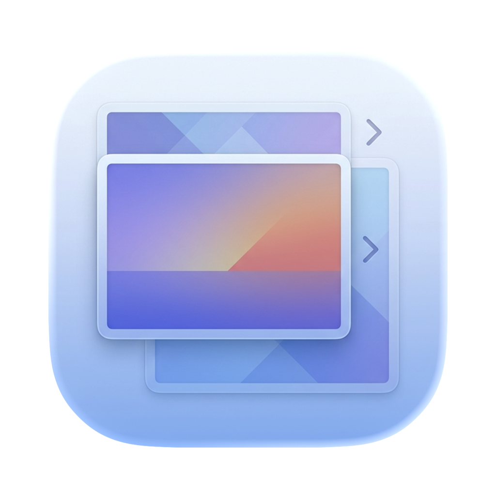

<div align="center">
  

  <h1>ImageCRC</h1>

  <p><strong>Bulk image optimization and format conversion for macOS.</strong></p>

  <p>
    
    
    
  </p>
</div>

---

Drop a folder of images, pick a format and quality, hit **Start**. ImageCRC fans the work out across every CPU core, shows a smooth progress overlay, and opens the output folder in Finder when it's done. Everything runs locally — no uploads, no telemetry.

## Features

- **Input:** JPG · JPEG · PNG · SVG · WebP · AVIF · HEIC
- **Output:** JPG · PNG · WebP · AVIF
- Quality slider (0–100%) with format-aware semantics — JPEG/AVIF/WebP scale linearly, PNG goes lossless at 100% and is quantized via `pngquant` below
- Optional resize (Fit / Fill with centered crop) before encoding; never upscales unless asked
- Parallel conversion bounded by `activeProcessorCount`, cancellable mid-run
- Light / Dark / System appearance toggle with animated transition

## Requirements

- macOS 14 Sonoma or newer (AVIF encoding requires 14+).
- Xcode 15.3+ **or** Command Line Tools for Xcode 15.3+ — provides the Swift 5.10 toolchain. Verify with `swift --version`. If missing: `xcode-select --install`.
- [Homebrew](https://brew.sh) — used to install `pngquant` below.
- **pngquant** — `brew install pngquant`. Required for PNG output at quality < 100 (the lossless ImageIO bytes are piped through `pngquant` for indexed-color quantization). `Scripts/make-app.sh` looks it up via `brew --prefix pngquant` and bundles the binary into `Contents/Resources/bin/` of the `.app`. Without it, `swift build` still succeeds, but `make-app.sh` prints a warning and PNG conversion below 100% quality will fail at runtime.

SwiftPM dependencies (`libwebp` via `SDWebImage/libwebp-Xcode`) resolve automatically on the first `swift build` — no manual install needed.

### Optional

- **XcodeGen** — `brew install xcodegen`. Only needed if you want to regenerate `ImageCRC.xcodeproj` from `project.yml` (`xcodegen generate`). The SwiftPM build (`make-app.sh`) does not use Xcode.

All other tools used by the build/packaging scripts (`codesign`, `sips`, `iconutil`, `hdiutil`, `/usr/libexec/PlistBuddy`) ship with macOS / the Xcode CLI tools.

## Build & run

```bash
./Scripts/make-app.sh
open ./ImageCRC.app
```

The script runs `swift build -c release`, assembles a `.app` bundle with an ad-hoc signature, and leaves it at `./ImageCRC.app`. Set `CONFIG=debug` for a debug build.

### Packaging

```bash
./Scripts/make-dmg.sh    # → ImageCRC-<version>.dmg
./Scripts/make-icon.sh   # regenerate Resources/AppIcon.icns from the 1024×1024 master
```

## Stack

- **Swift + SwiftUI** — single-window app, `@Observable` state, no AppKit shell.
- **ImageIO** for JPG / PNG / HEIC / AVIF · **libwebp** (via `SDWebImage/libwebp-Xcode`) for WebP · **NSImage** for SVG rasterization · **pngquant** subprocess for PNG lossy.
- **`TaskGroup`-based** parallel pipeline bounded by CPU count, cooperative cancellation between decode → resize → encode → write.
- **MVVM** split — `ConversionViewModel` is the only bridge between the UI and an `AsyncStream<ConversionEvent>` driven by `ImageConverter`.

See [`CLAUDE.md`](CLAUDE.md) for the full architecture map.

## Design docs

- [Original design](docs/superpowers/specs/2026-04-17-img-cc-design.md) — quality semantics, concurrency model
- [Resize feature](docs/superpowers/specs/2026-04-18-resize-design.md)
- [Dark theme](docs/superpowers/specs/2026-04-20-dark-theme-design.md)

## Distribution note

`pngquant` is bundled into the `.app` and is licensed under GPL v3, so any redistributed binary is a combined GPL v3 work — and therefore not eligible for the Mac App Store.
